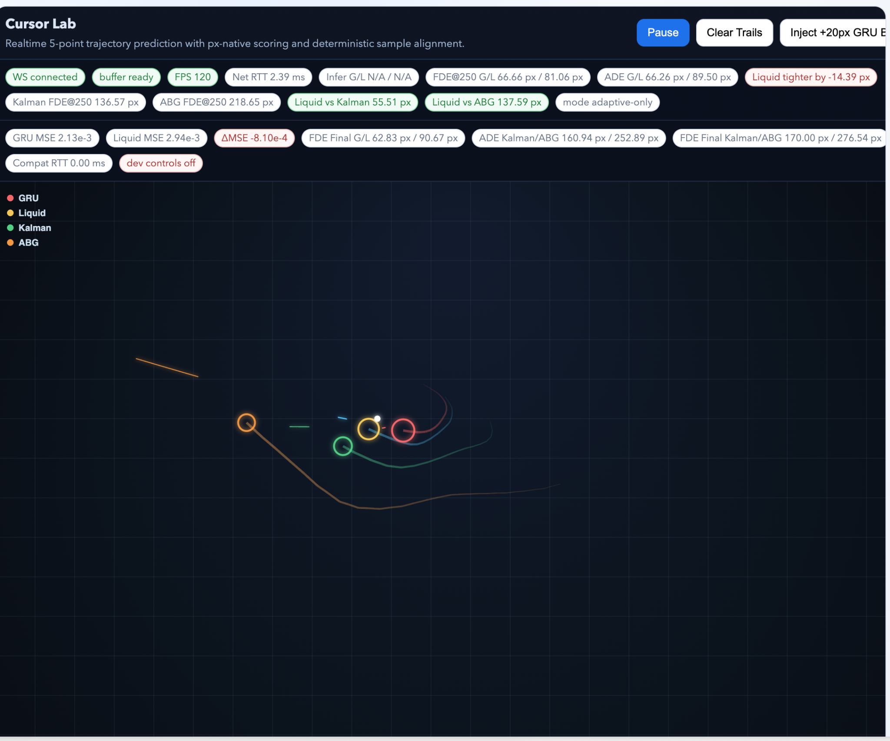

# Fisac

Fisac is a local liquid-model research workspace that combines online liquid
MoE experiments, benchmark tooling, a FastAPI chat backend, a React chat UI,
and the Cursor Lab realtime trajectory demo.



## Benchmark Note

```text
Seed-level uncertainty is now the primary unit (n=5), with explicit raw paired
outputs and CI reporting. Requested definitions gain_vs_gru is defined in
benchmark_robust.py#L138: gain_vs_gru = (gru_post - liquid_post) / max(gru_post,
1e-8) post_shift region is defined via _post_shift_error in benchmark_liquid.py#L58:
"after regime change," using the next 80 steps per shift (including the shift
step), then averaged. Head-to-head trials per seed in win_rate_vs_gru: 4
(one per task: task_a, task_b, task_c, task_real), from benchmark_robust.py#L236.
5-seed paired results (n=5 seeds, mean +/- std, SE) TaskLiquid MSE (unitless)GRU
MSE (unitless)Delta MSE = GRU-Liquid (MSE)Relative gain vs GRUEWMA MSE
(unitless)Delta MSE = EWMA-Liquid (MSE)Relative gain vs EWMATrain Steps/sSeconds/Step
(s)Peak RAM (GB) task_a 0.0097 +/- 0.0002 (SE 0.0001) 0.0183 +/- 0.0009
(SE 0.0004) 0.0085 +/- 0.0007 (SE 0.0003) 0.4387 +/- 0.0185 (SE 0.0083)
0.0156 +/- 0.0000 (SE 0.0000) 0.0059 +/- 0.0002 (SE 0.0001) 0.6091 +/- 0.0032
(SE 0.0014) 93.4306 +/- 4.8219 (SE 2.1564) 0.0107 +/- 0.0005 (SE 0.0002)
0.3855 +/- 0.0494 (SE 0.0221) task_b 0.1397 +/- 0.0018 (SE 0.0008) 0.6240
+/- 0.0033 (SE 0.0015) 0.4843 +/- 0.0042 (SE 0.0019) 0.7880 +/- 0.0029
(SE 0.0013) 0.9178 +/- 0.0008 (SE 0.0003) 0.7782 +/- 0.0014 (SE 0.0006)
0.8727 +/- 0.0015 (SE 0.0007) 37.6615 +/- 1.6318 (SE 0.7298) 0.0266 +/- 0.0011
(SE 0.0005) 0.3860 +/- 0.0483 (SE 0.0216) task_c 0.0121 +/- 0.0005 (SE 0.0002)
0.0205 +/- 0.0017 (SE 0.0008) 0.0084 +/- 0.0016 (SE 0.0007) 0.4352 +/- 0.0226
(SE 0.0101) 0.0276 +/- 0.0003 (SE 0.0001) 0.0155 +/- 0.0006 (SE 0.0003)
0.5320 +/- 0.0305 (SE 0.0136) 97.8291 +/- 7.7241 (SE 3.4543) 0.0103 +/- 0.0008
(SE 0.0004) 0.3860 +/- 0.0483 (SE 0.0216) task_real 0.0139 +/- 0.0027
(SE 0.0012) 0.0525 +/- 0.0091 (SE 0.0041) 0.0386 +/- 0.0066 (SE 0.0030)
0.7570 +/- 0.0245 (SE 0.0109) 0.0880 +/- 0.0093 (SE 0.0041) 0.0741 +/- 0.0070
(SE 0.0031) 0.8886 +/- 0.0252 (SE 0.0113) 50.3681 +/- 2.3402 (SE 1.0466)
0.0199 +/- 0.0009 (SE 0.0004) 0.4076 +/- 0.0000 (SE 0.0000) Win rates
(x/n, 95% Clopper-Pearson CI) Overall vs GRU: 20/20, CI [[0.832, 1.000]]
(app://-/index.html#) Overall vs EWMA: 20/20, CI [[0.832, 1.000]](app://-/index.html#)
Per task vs GRU: 5/5 each (task_a/b/c/real), CI [[0.478, 1.000]](app://-/index.html#)
Per task vs EWMA: 5/5 each (task_a/b/c/real), CI [[0.478, 1.000]](app://-/index.html#)
Paired test (seed-level, optional significance) Added paired two-sided sign
test in benchmark_stats.py#L60. For Delta MSE vs GRU and Delta MSE vs EWMA,
each task gives p=0.0625 (all 5/5 positive; small n). Raw paired rows + schema
(published) JSON schema + rows: paired_rows.json CSV rows: paired_rows.csv
Seed-level stats JSON: summary_stats.json Table output: summary_table.md Raw
robust run: robust_5seed.json
```

## Repository Overview

- `silicon_synapse.py`, `sleep_cycle.py`, `environment_stream.py`,
  `myelination.py`: core liquid-model experiments and online adaptation loops.
- `benchmark_liquid.py`, `benchmark_robust.py`, `benchmark_stats.py`,
  `run_benchmark_suite.py`: single-run, multi-seed, reporting, and full-suite
  benchmark entrypoints.
- `chat_api/`: FastAPI backend, orchestration services, reasoning pipeline, and
  local runtime state.
- `chat_ui/`: Vite + React frontend for chat and Cursor Lab.
- `organic_cursor/`: cursor capture, training, inference, runtime, and static demo.
- `docs/`: project notes including chat interface details and golden-mode docs.
- `scripts/`: chat startup, reasoning dataset/training, and benchmark helpers.
- `tests/`: backend, benchmark, cursor, and integration coverage.

Historical backups and generated benchmark outputs are kept locally but are now
ignored by git via `.gitignore`.

## Quick Start

PyTorch is most predictable here on Python 3.12.

```bash
brew install pyenv
pyenv install 3.12.8
pyenv local 3.12.8

python -m venv .venv
source .venv/bin/activate
python -m pip install --upgrade pip
pip install torch pytest fastapi uvicorn pydantic httpx

npm --prefix chat_ui install
```

Optional dependency for `organic_cursor/capture.py`:

```bash
pip install pynput
```

## Common Commands

Run the core liquid prototype:

```bash
python silicon_synapse.py
```

Run a single benchmark:

```bash
python benchmark_liquid.py --steps 3000 --experts 128 --dim 64 --device auto --seed 7
```

Run the paired multi-seed benchmark:

```bash
python benchmark_robust.py \
  --seeds 7,11,19 \
  --synthetic-steps 800 \
  --real-steps 1000 \
  --structural-steps 8000 \
  --experts 64 \
  --dim 64 \
  --top-k 4 \
  --batch-size 16 \
  --device cpu \
  --fuse-window 4000
```

Generate seed-level tables from a raw robust run:

```bash
python benchmark_stats.py \
  --input /tmp/robust_5seed.json \
  --output-dir /tmp/robust_5seed_report
```

Run the full benchmark suite:

```bash
python run_benchmark_suite.py
```

Start the chat stack:

```bash
./scripts/dev_chat.sh
```

Run tests:

```bash
pytest -q
```

## Outputs and Reports

- `benchmark_runs/` receives timestamped benchmark and pipeline outputs.
- `summary_stats.json`, `summary_table.md`, `paired_rows.json`, and
  `paired_rows.csv` are the primary report artifacts from `benchmark_stats.py`.
- `chat_reasoning_benchmark.py`, `chat_benchmark.py`, and
  `scripts/run_genius_pipeline.sh` extend the evaluation flow into the chat
  stack and jury/reasoning heads.

## Cursor Lab

Cursor Lab lives in the chat UI and streams realtime prediction over
`/ws/cursor`. The screenshot above shows the px-native scoring UI used to
compare GRU, Liquid, Kalman, and ABG trajectories in the same live scene.
